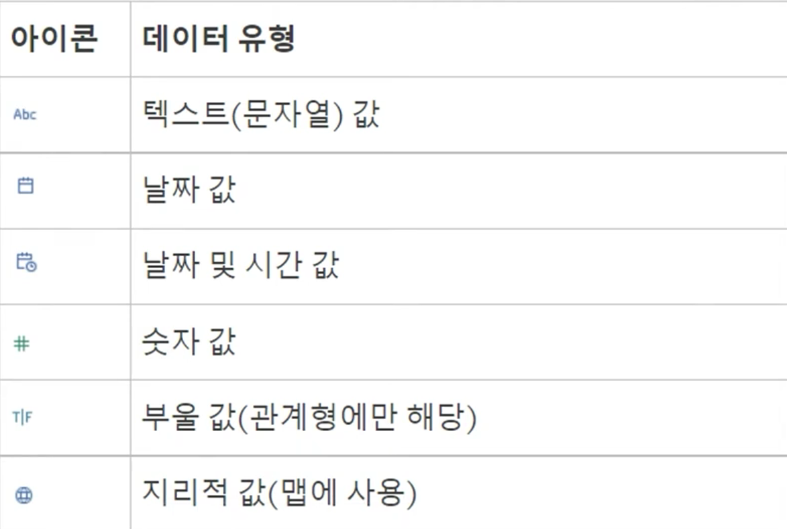
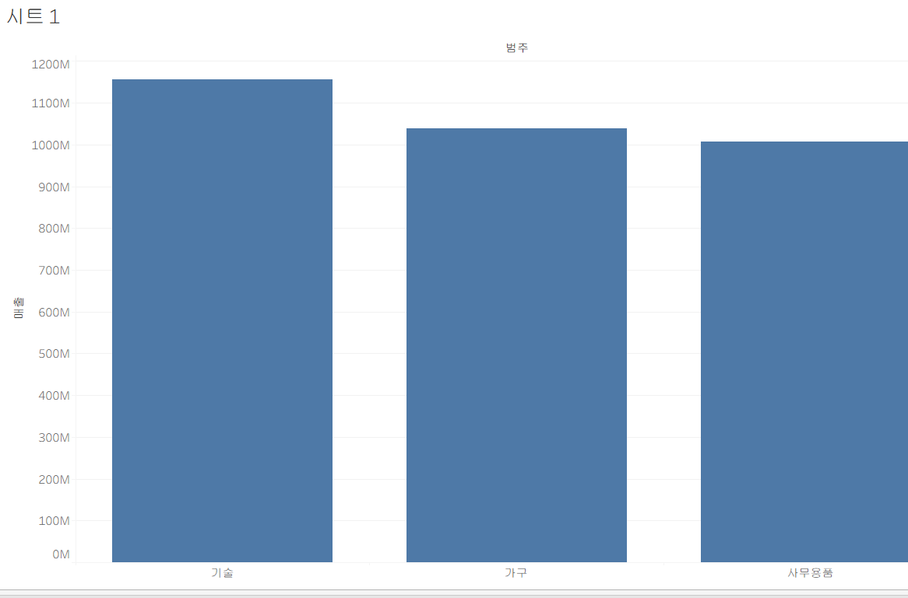
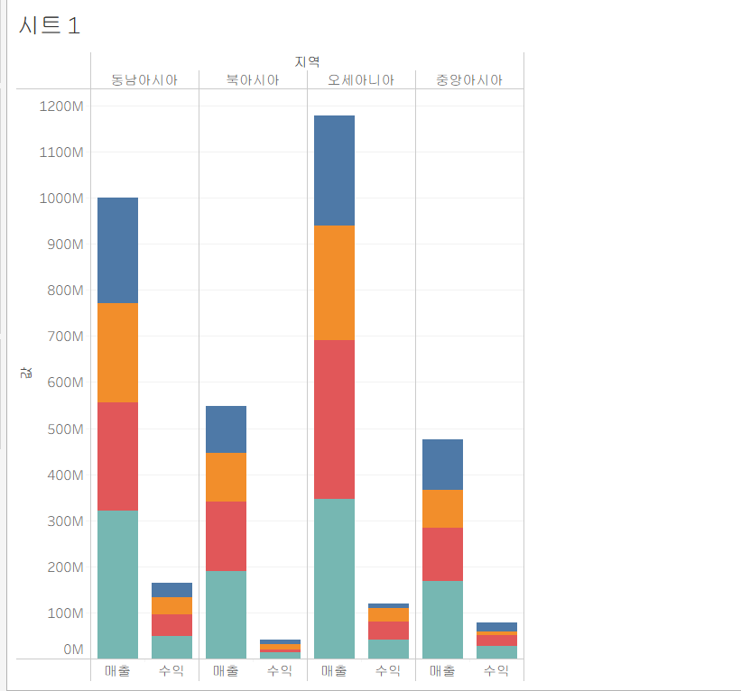

# Week 1
## 데이터 연결
### 원본데이터 연결하기
- [파일에 연결]
  - 엑셀 파일, JSON 파일 등을 연결 가능
- [서버에 연결]
  - 구글 드라이브(구글 시트 등)등에 연결 가능 

### 데이터 연결방식
- 라이브: 태블로가 데이터에 직접 연결
  - 원본 데이터에 변화가 생기면 바로 적용
  - 데이터 양이 많아지면 속도/성능 저하
- 추출: 현재 데이터 원본을 태블로 분석에 용이한 하이퍼 형식의 파일로 저장
  - 태블로에서는 추출된 하이퍼 파일로 분석 진행

### 데이터 유형

- 메타데이터/데이터 그리드에서 필드유형 변경 가능
- 필드유형 칸 아래세모 모양 클릭하면 다양한 기능 제공

### 필터 추가
- 데이터 연결 과정에서 미리 데이터를 필터링하여 필요한 데이터만 사용

## 데이터 결합
### 관계로 결합
> 두 테이블을 각각 drag&drop
- 결합하려는 데이터 간의 유형이 동일해야함(같은 필드값 가짐)
- 처음 drag&drop한 테이블이 루트테이블 -> 순서에 유의해야함!
- 원본 테이블 각각 독립적 활용 -> 이 방법 권장

### 조인으로 결합
> 한 테이블을 drag&drop 후 더블클릭해 테이블을 열고, 그 상태에서 나머지 테이블 drag&drop
- 결합하려는 데이터 간의 유형이 동일해야함(같은 필드값 가짐)
- INNER, LEFT, RIGHT, OUTER 조인 가능

### 혼합으로 결합
> 한 테이블을 drag&drop 후 시트에서 나머지 데이터 원본 불러오기 -> 두 데이터 원본 있으면 각 열과 행에 원하는 칼럼 drag&drop
- 관계와 조인과 달리 직접 데이터 결합 X. 각 결과 독립적 집계 후 **한 시트에서 시각화** 가능하게 함

### 유니온으로 결합
> [새 유니온] 이용

> 테이블을 다른 테이블 바로 밑에 drag&drop
- 열을 추가하는 관계/조인/혼합과 달리 **행을 추가**하는 방식
- 데이터의 테이블 구조가 동일해야함(필드수, 필드명, 필드유형 등)

## 차원과 측정값
태블로는 데이터의 열을 필드로 만들고, 데이터의 유형에 따라 필드를 차원 또는 측정값으로 할당함
### 차원
- 정성적인 값을 가진 필드 -> 집계되거나 계산되지 않음
- 시각화 시트에서 테이블의 위쪽에 위치
### 측정값
- 정량적인 수치값을 가짐
- 시각화 시트에서 테이블의 아래쪽에 위치

### 연속형과 불연속형 필드
- 연속형 필드: 값이 끊기지 않고 이어지는 데이터(녹색으로 표시됨)
- 불연속형 필드: 값이 끊어진 범주로 나뉨(파란색으로 표시됨)

차원은 무조건 불연속, 측정값은 무조건 연속? **NO!** '주문 일자`라는 칼럼은 차원이나 목적에 따라 연속형 필드가 될수도 있음(2021년~2026년)

## 시각화하기
### 막대그래프
#### 세로 막대그래프

#### 누적 병렬 막대그래프

